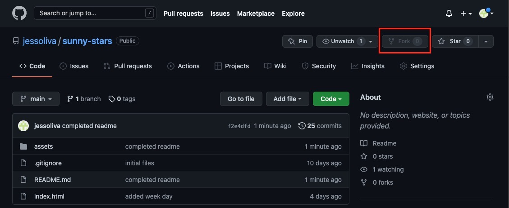
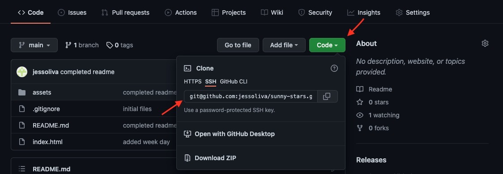
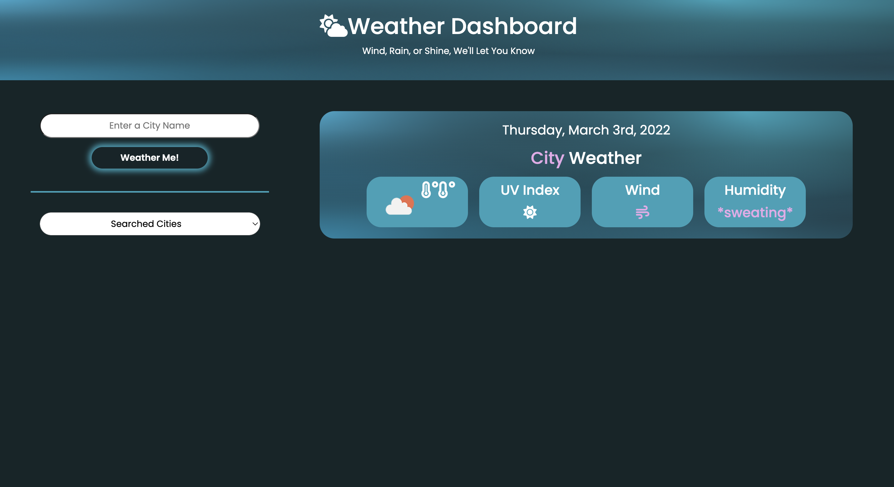
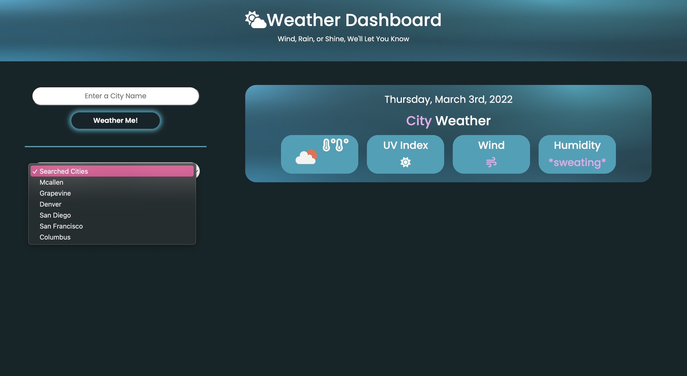
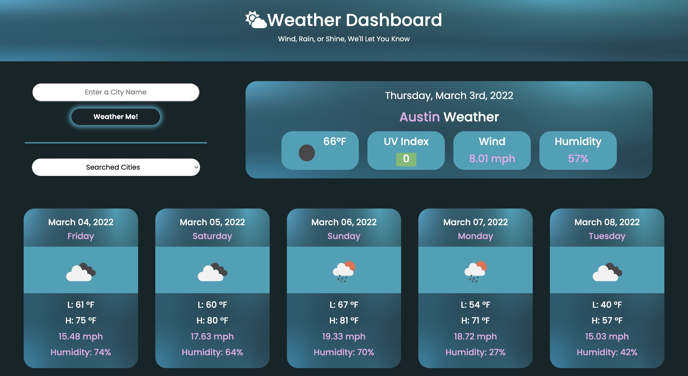
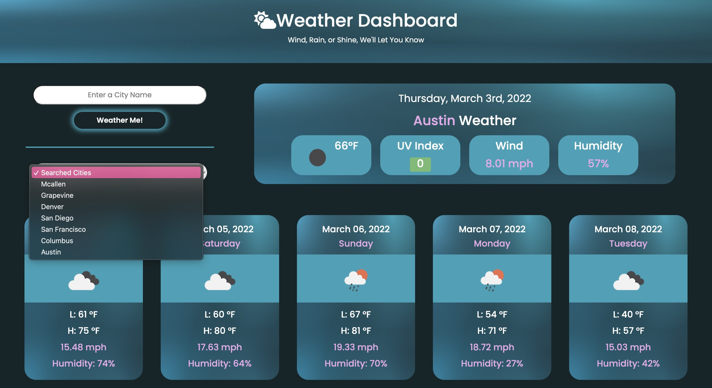

# SunnySkies

Whether you're planning a trip or looking for a new place to live because you're having a crisis, utilize this website to get the current and future weather for any city! It'll help you plan your trip accordingly or check if the new city you want to move to is warm ☀️ or cool ☃️ enough for you 😊

[Visit SunnySkies ✨](https://jessoliva.github.io/sunny-stars/)

## 📚&nbsp; Table of Contents

- [✨&nbsp; Description](#description)
- [🌼&nbsp; Features](#features)
- [🛠️&nbsp; Installation](#installation)
- [👩🏽‍💻&nbsp; Usage](#usage)
- [✏️&nbsp; Contribution Guidelines](#contribution-guidelines)
- [👨‍👩‍👧‍👦&nbsp; Credits](#credits)
- [📱&nbsp; Contact](#contact)
- [📰&nbsp; License](#license)

## ✨&nbsp; Description

Through coding this website, I learned to utilize server-side APIs. For this project, I used (2) APIs provided by OpenWeatherMap: Geo and OneCall. For these APIs, I learned how to read their documentation, fetch their data, convert it to JSON, and utilize the data to display certain information on the site based on user input.

The Geo API receives the name of a city and provides the latitude and longitude of that city. The latitude and longitude is then sent to the OneCall API to retrieve the current and forecast weather for that location, which is then displayed on the site.

The OneCall API provided the dates for the current and forecast weather in Unix Timestamp. I used moment to convert those timestamps into a readable dates.

I decided to display the cities searched by the user that are saved in local storage in a dropdown menu. To prevent saving duplicate cities the user already searched, I used the .include() method in an if/else if condition.

When refreshed, the cities in local storage are automatically loaded and displayed in the dropdown. However, I came across the issue where the city the user searched was not added into the dropdown menu until the site was refreshed. I wanted the city to be added and displayed as soon as the user searched it. So I called the function that displayed the cities in the dropdown within one of the else if condition with the .includes() method.

I added a function to capitalize the cities searched when displayed on the site. I had to take into account city names with one word vs multiple words. To differentiate the two, I was able to use the .includes() method here to look for a space ' ' within the city name. Then the function would capitalize the city name accordingly.

## 🌼&nbsp; Features

- User friendly interface
- Functionality to search current and future weather for a city
- Searched cities are added to local storage
  - Cities saved to search history are displayed on a dropdown menu
  - Cities in dropdown are clickable to easily revisit
- The current weather will include:
  - current temperature in Fahrenheit
  - weather conditions represented as an icon
  - uv index
    - container displaying the value will change color depending on the value
      - green 🟢 &nbsp;= low
      - orange 🟠 &nbsp;= moderate
      - red 🔴 &nbsp;= high
  - wind speed in mph
  - humidity
- The 5 day weather forecast will include:
  - week day
  - current temperature in Fahrenheit
  - weather conditions represented as an icon
  - wind speed in mph
  - humidity

## 🛠️&nbsp; Installation

At the main page of the sunny-stars repository click on 'Fork' on the right hand side. This will clone the repository onto your GitHub!

&emsp;&emsp;&emsp; 

Then go to the main page of the forked repository on your GitHub and click on '<> Code'. From there, copy your preferred URL to clone the repository onto your computer. My go to is SSH!

&emsp;&emsp;&emsp; 

Go to your terminal or the VSCode terminal, cd into the directory you want the cloned repository to be located in and enter the following command and replace the placeholder with the URL link you copied:

    git clone <INSERT-COPIED-URL>

Now the sunny-stars repository is on your GitHub and local computer! 

## 👩🏽‍💻&nbsp; Usage

To use, simply enter a city and click on 'Weather Me!'. The container on the right hand side will update with the current weather of the city you searched and the bottom will display 5 containers for the weather forecast of the 5 following days.

Additionally, the website includes persistent search history data, so the cities you searched will be added to the dropdown menu to quickly select again!

&emsp;&emsp;&emsp; 

&emsp;&emsp;&emsp; 

&emsp;&emsp;&emsp; 

&emsp;&emsp;&emsp; 

## ✏️&nbsp; Contribution Guidelines

## 👨‍👩‍👧‍👦&nbsp; Credits

- [Bobby Hadz - Array includes()](<https://bobbyhadz.com/blog/javascript-array-push-if-not-exist#:~:text=over%20includes()%20.-,To%20push%20an%20element%20in%20an%20array%20if%20it%20doesn,()%20method%20to%20add%20it>)
- [Stack Overflow - Select Value Without Button](https://stackoverflow.com/questions/46329633/select-value-without-button)
- [W3Schools - event onchange](https://www.w3schools.com/jsref/event_onchange.asp)
- [FreeCodeCamp - Capitalize Words](https://www.freecodecamp.org/news/how-to-capitalize-words-in-javascript/)

## 📱&nbsp; Contact

If you have any questions related to this project, or you just want to interact, you can reach me via GitHub or E-mail!

> Github: [jess-oliva](https://github.com/jess)

> E-mail: [jessoliva.g@gmail.com](mailto:jess)

## 📰&nbsp; License

    Copyright 2022 Jessica Olivares

Permission is hereby granted, free of charge, to any person obtaining a copy of this software and associated documentation files (the "Software"), to deal in the Software without restriction, including without limitation the rights to use, copy, modify, merge, publish, distribute, sublicense, and/or sell copies of the Software, and to permit persons to whom the Software is furnished to do so, subject to the following conditions:

The above copyright notice and this permission notice shall be included in all copies or substantial portions of the Software.

THE SOFTWARE IS PROVIDED "AS IS", WITHOUT WARRANTY OF ANY KIND, EXPRESS OR IMPLIED, INCLUDING BUT NOT LIMITED TO THE WARRANTIES OF MERCHANTABILITY, FITNESS FOR A PARTICULAR PURPOSE AND NONINFRINGEMENT. IN NO EVENT SHALL THE AUTHORS OR COPYRIGHT HOLDERS BE LIABLE FOR ANY CLAIM, DAMAGES OR OTHER LIABILITY, WHETHER IN AN ACTION OF CONTRACT, TORT OR OTHERWISE, ARISING FROM, OUT OF OR IN CONNECTION WITH THE SOFTWARE OR THE USE OR OTHER DEALINGS IN THE SOFTWARE.
